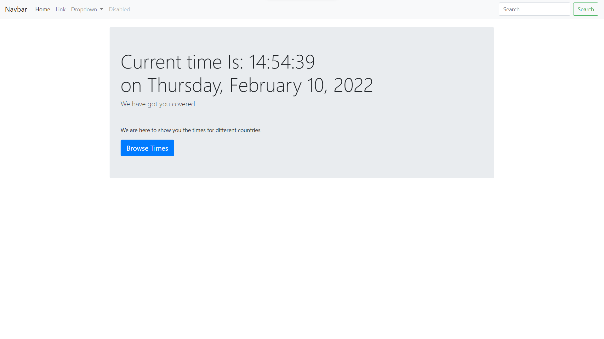

# **Javascript Practice**
This repo contains my practice for JS

### **Honor Code**
I am leaving this open source on the honor system. Please do not plagarize my code! You will only learn by investing the time to work through the problems yourself!

### **Project Clock Web App**

A conventional clock web app made from scratch using just html, css and js.

### **Deployment**
The web app is deployed using github pages and can be viewed at <a href="https://zainmujahid.me/clock-web-app-js/" target="_blank">https://zainmujahid.me/clock-web-app-js/</a>

### **Contributing** 💡
> #### Step 1

- **Option 1**
    - 🍴 Fork this repo!

- **Option 2**
    - 👯 Clone this repo to your local machine.

> #### Step 2

- **Build your code** 🔨🔨🔨

> #### Step 3

- 🔃 Create a new pull request.

### **License 📄**
This project is licensed under the MIT License - see the [LICENSE](./LICENSE) file for details.